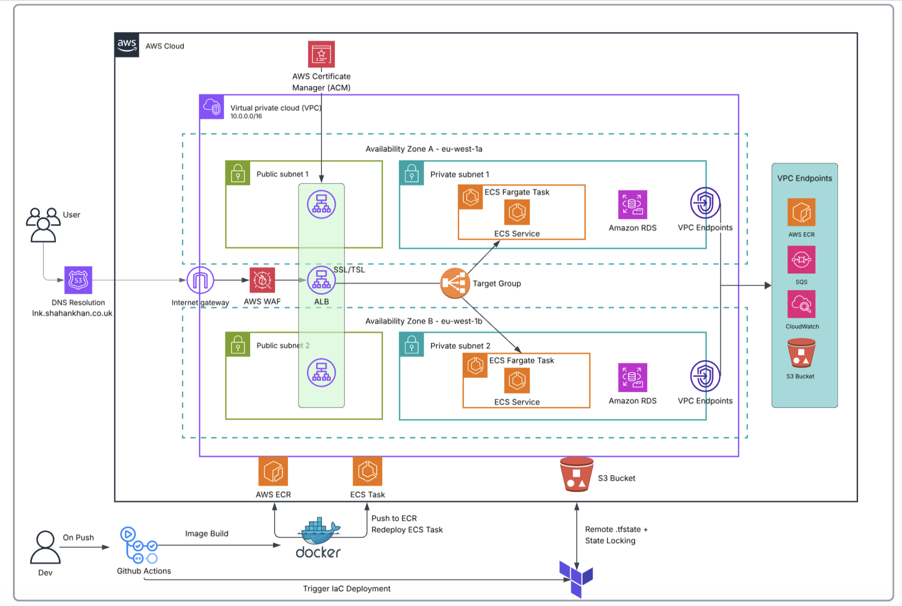
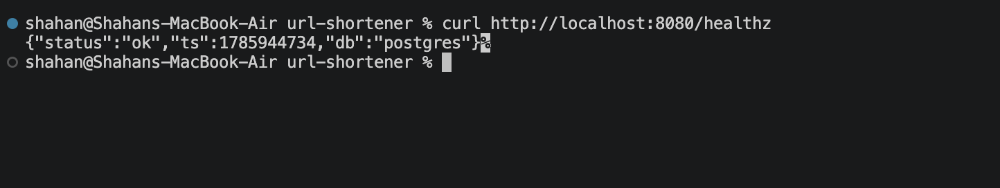

# URL Shortner ECS Fargate

A high-availability, microservices-based URL shortener application containerised and deployed via AWS ECS Fargate within a multi-AZ VPC. With CI/CD via github actions. ingress traffic is managed via an ALB with WAF rules configured for con trolled access and security.Infrastructure provisioning and deployment pipelines are fully automated using Terraform and GitHub Actions.

## Overview
- **AWS ECS Fargate**: Serverless, scalable compute option to host and run the application
- **Networking:** Custom VPC, Private/Public Subnets, Routes, Security Groups, ALB
- **AWS WAF**: Filtering web requests for enhanced security
- **VPC Endpoints**: Cost-efficient option to provide private access to AWS resources. Eliminating use of expensive NAT Gateways
- **PostgreSQL (RDS)**: Stores click analytics
- **TLS/DNS**: SSL Certification configured via ACM, DNS (Cloudflare), fully automated
- **Github Actions**: CI/CD pipelines to containerise application and deploy Terraform provisioned infrastructure. OIDC enabled.
- **Infrastructure as Code (IaC):** Terraform manages all infrastructure, fully automated

## Demo

> **Note:** The video demonstrates the full AWS ECS Fargate infrastructure deployment process and application functionalities.

## Architecture



**Traffic flow:**

```
User --> queries Route53 (lnk.shahankhan.co.uk) --> Route53 resolves to ALB -->  AWS WAF (Web Application Firewall) Inspects payload, blocks malicious IPs --> ALB redirects any HTTP(port 80) traffic to HTTPS(Port 443) --> ALB directs traffic to Target Group (ECS Fargate Task)
```

| Design Decision | Rationale |
| :--- | :--- |
| **Compute: ECS Fargate** | Provides serverless container orchestration, removing the operational overhead of managing EC2 instances. |
| **IaC: Terraform** | Ensures idempotency, reproducible infrastructure, and automated configuration management. |
| **State Management: S3 + Native Locking** | S3 used for `.tfstate` locking (`use_lockfile = true`), eliminating the need for external database dependencies like DynamoDB. |
| **Ingress: ALB + AWS WAF** | Provides SSL/TLS termination, high availability, edge rate-limiting to prevent DDoS attacks, and allows ECS tasks to be completely isolated in private subnets. |
| **Networking: AWS VPC Endpoints** | Replaces costly NAT Gateways with AWS Interface/Gateway VPC Endpoints, keeping internal AWS traffic (ECR, CloudWatch, S3) on the private AWS network to cut networking costs by ~30%. |
| **Database: PostgreSQL over DynamoDB** | Simple relational mapping for short codes to URLs, guarantees link uniqueness, and allows easy local setup with Docker without AWS lock-in. |

## Project Architecture

```
.
├── .github/
│   ├── assets/               # Architecture diagrams and healthcheck screenshots
│   └── workflows/            # GitHub Actions CI/CD pipelines
│       ├── docker-build-push.yml
│       └── terraform-deploy.yml
├── app/                      # Primary API service (URL shortener application)
├── backend-bootstrap/        # Initial S3/DynamoDB remote state backend setup
├── infra/                    # Infrastructure as Code (Terraform)
│   ├── modules/              # Reusable Terraform modules
│   │   ├── acm/              # SSL/TLS certificate management
│   │   ├── alb/              # Application Load Balancer
│   │   ├── db/               # PostgreSQL Database provisioning
│   │   ├── dns/              # Route53 DNS configurations
│   │   ├── ecs/              # ECS Cluster & Task Definitions (API, Worker, Dashboard)
│   │   ├── elasticache/      # Redis caching layer
│   │   ├── iam/              # IAM roles and policies
│   │   ├── route53/          # DNS records management
│   │   ├── sg/               # Security Groups definition
│   │   ├── sqs/              # Simple Queue Service for event processing
│   │   ├── vpc/              # VPC, Subnets, Internet/NAT Gateways
│   │   └── waf/              # Web Application Firewall for protection
│   ├── main.tf               # Root Terraform configuration
│   ├── providers.tf          # Provider setup (AWS)
│   └── variables.tf          # Global infrastructure variables
├── services/                 # Microservices ecosystem
│   ├── dashboard/            # Analytics dashboard UI/API (Go)
│   └── worker/               # Async event processing worker (Go)
└── docker-compose.yml        # Local orchestration (Postgres, Redis, App Services)
```


## Infrastructure
**Custom VPC:** Consisting of 2 public subnets and 2 Private subnets across 2 AZ's. Ensuring high availability.

**Internet Gateway:** Internet gateway enabling bidirectional traffic

**Route53:** Provides DNS Resolution for domain `(lnk.shahankhan.co.uk)` to ALB via Alias record.

**ACM & Cloudflare Integration:** Automates TLS certificate issuance and validation by managing DNS records via the Cloudflare API.

**Application Load Balancer:** Handles SSL/TLS termination, enforces HTTP-to-HTTPS redirection,routes traffic across multi-AZ public subnets. Integrated with **AWS WAF** to inspect payloads and mitigate common web exploits and malicious bot traffic.

**ECS/Fargate:** Serverless container orchestration. Provisoned across multiple AZ's ensuring high avialability.

**S3 Bucket:** `.tfstate` is stored in secure S3 bucket with native locking enabled. Ensuring idempotency and and prevent concurrent modification by multiple users or processes.

**VPC Endpoints:** VPC Endpoints for AWS Resources, eliminating costly NAT Gateways and keeping traffic within AWS Backbone for secure traffic flow

## Local Setup (Quick start)

**Prerequisites:** Docker

```bash
docker compose up --build
```
> **Note:** SQS Will not work locally currently as it requires AWS SQS 

You can run a health check via:
`curl http://localhost:8080/healthz`



## Setup Order & Prerequisites

Before running the automated deployment pipelines, the S3 bucket for .tfstate file must be provisioned and GitHub authentication paths must be provisioned manually.

### 1. Bootstrap the S3 Backend (`backend-bootstrap/`)

```bash
cd backend-boostrap/
terraform init
terraform apply -auto-approve
```

This will generate the S3 bucket required to store your .tfstate file. Enabling versioning.

### 2. Configure GitHub Secrets & Variables

| Name             | Type     | Description                                                           | Example / Format |
| :--------------- | :------- | :-------------------------------------------------------------------- | :--------------- |
| `AWS_ACCOUNT_ID` | Variable | AWS Account ID used by GitHub Actions to assume the IAM role via OIDC | `123456789012`   |

## Security profile and decisions
- IAM OIDC Identity Providers: GitHub Actions workflows communicates with AWS securely using OpenID Connect roles. No permanent AWS credentials or tokens are stored in the repo.
- VPC Endpoints: Route traffic to AWS services privately within the AWS network, bypassing the internet to improve security and reduce NAT Gateway data transfer costs.
- Network Isolation: The application container layer possesses zero public IP addresses. It is locked inside a private subnet layer protected by stateful security groups that only accept incoming inputs on port 8080 stemming exclusively from the ALB's security group ID.

## CI/CD Pipelines